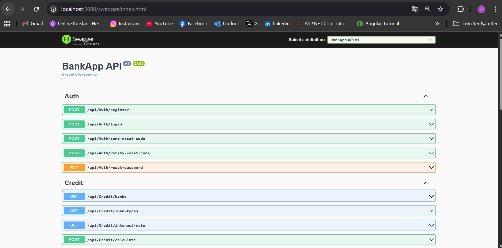
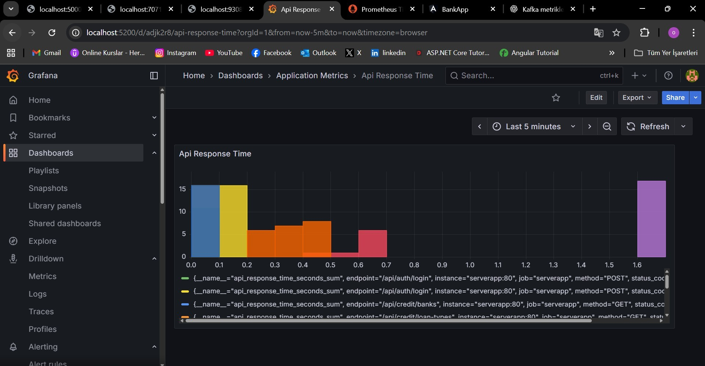
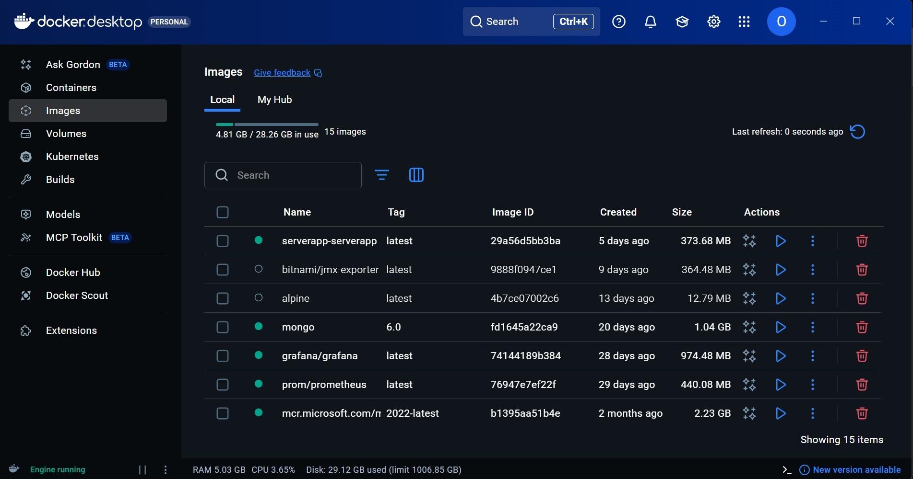
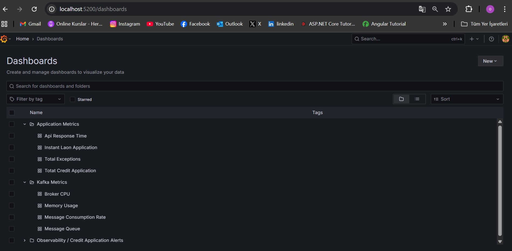
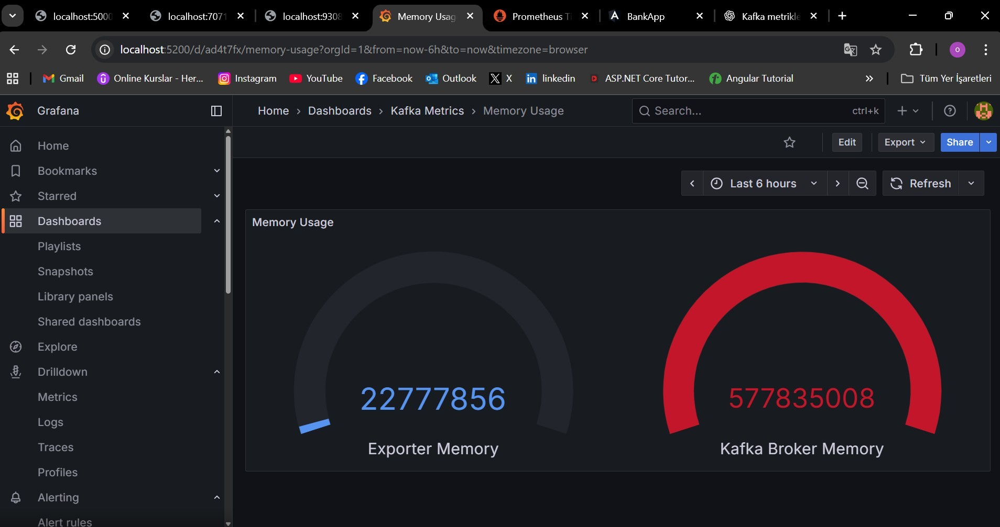

# Bankacılık ve Kredi Başvuru Uygulaması (Full-Stack)

Bu proje, **Angular** (Frontend) ve **.NET Core Web API** (Backend) kullanılarak geliştirilmiş, bankacılık ve kredi uygulamalarını kapsayan, **Docker** ve **Gözlemlenebilirlik** (Prometheus, Grafana, Kafka) odaklı modern bir uygulamadır.

---

## Ana Özellikler

### Frontend (Angular)
* **Kullanıcı Akışı:** Kayıt, Giriş, **Şifre Sıfırlama (E-posta ile)**, Profil/Bakiye Güncelleme.
* **Kredi İşlemleri:** Kredi Hesaplama (Faiz Oranı Getirme), Kredi Başvurusu ve Başvuru Takibi.
* **Güvenlik:** **JWT** Kimlik Doğrulama ve `AuthInterceptor` kullanımı.

### Backend (.NET Core 3.1 Web API)
* **Mimari:** Katmanlı (Repository/Service/Controller) ve temiz kod yaklaşımı.
* **Veritabanı:** **MSSQL** (Ana Veri), **MongoDB** (Kredi Olay Logları).
* **Gözlemlenebilirlik:** **Prometheus** metrikleri (API Süresi, Hatalar) ve MongoDB'ye Event Loglama.
* **E-posta:** Şifre sıfırlama işlemleri için **SMTP** (Mailtrap Sandbox) entegrasyonu.

---

## Teknolojiler

| Alan | Teknoloji | Not |
| :--- | :--- | :--- |
| **Frontend** | Angular | UI/UX Katmanı |
| **Backend** | .NET Core 3.1 | Web API ve İş Mantığı |
| **Veri (İlişkisel)**| MSSQL | Kullanıcı, Kredi, Banka Verileri |
| **Veri (Olay Kaydı)**| MongoDB | Kredi Başvuru Olaylarını Kaydetme |
| **Altyapı** | Docker, Docker Compose | Tüm servislere tek elden yönetim |
| **Gözlemlenebilirlik** | Prometheus, Grafana | Metrik Toplama ve Görselleştirme |
| **Mesajlaşma** | Kafka, Zookeeper | Olay Akışı Altyapısı |

---

## Kurulum Öncesi Not (E-posta Ayarları)

Uygulama, şifre sıfırlama işlemlerinde e-posta göndermek için bir SMTP sunucusuna ihtiyaç duyar. Varsayılan olarak Mailtrap Sandbox bilgileri kullanılmıştır.

Lütfen `ServerApp/appsettings.json` dosyasındaki `EmailSettings` bloğunu kendi Mailtrap veya SMTP sunucu bilgilerinizle **güncelleyin**. Aksi takdirde, şifre sıfırlama özelliği çalışmayacaktır.

```json
"EmailSettings": {
    "SmtpHost": "sandbox.smtp.mailtrap.io",
    "SmtpPort": 2525,
    "SmtpUser": "--------",                   // Kendi SMTP kullanıcı adınızla değiştirin!
    "SmtpPass": "--------",                   // Kendi SMTP şifrenizle değiştirin!
    "FromName": "BankApp",
    "FromEmail": "noreply@myapp.com"
}
```

## Başlangıç Kılavuzu (Docker Compose)
### Projeyi çalıştırmak için Docker ve Docker Compose gereklidir.
### Ortamı Başlatma:
```bash
docker-compose up -d
```
(Bu komut, tüm servisleri (DB, Kafka, Prometheus, ServerApp) ayağa kaldırır ve MSSQL veritabanını restore eder.)

### Frontend'i Çalıştırma:
```
cd ClientApp
npm install
npm start
```

### Servis Erişim Bilgileri:
```
Servis	                          Adres
Frontend Uygulama	              http://localhost:4200
Backend API (Swagger)	          http://localhost:5000/swagger
Grafana Dashboard	              http://localhost:5200
Prometheus Metrikleri	          http://localhost:5000/metrics
```

## Proje Kanıtları ve Altyapı

### 1. Sistem Mimarisi ve Konteyner Yönetimi

    Tüm altyapı servislerinin (DB, API, Log, Metrikler) Docker konteynerlerinde çalışır durumu.

### 2. Gözlemlenebilirlik (Grafana & Prometheus)

    Grafana panosu üzerinden API ve Kafka metriklerinin izlenmesi.

### 3. Kritik Backend Kod ve Loglama

    Alan                                Açıklama
    Global Hata Yönetimi                Özel Middleware ile tüm hataların yakalanıp metriklerinin artırılması.
    API Yanıt Süresi                    API'lerin çalışma hızını ölçen Middleware.
    Olay Loglama                        Başvuruların MongoDB'ye event olarak kaydedilmesi.
    (MongoDB)


### 4. API Dökümantasyonu
    Uygulanan API uç noktalarının Swagger üzerinden görünümü.


## Kafka Entegrasyonu

Kafka, olay akışı ve asenkron işlemler için altyapı olarak kurulmuştur.

Kafka Topic Oluşturma ve Tüketme (Docker içinde):

```
# Topic oluşturma
docker exec -it kafka kafka-topics --create --bootstrap-server localhost:9092 --replication-factor 1 --partitions 1 --topic test-topic

# Consumer başlatma
docker exec -it kafka kafka-console-consumer --bootstrap-server localhost:9092 --topic test-topic --from-beginning --group test-group
```

## Proje Görselleri 
### Front-End.



### Projede oluşturulan API' ler.


### API response grafiği.


### Docker yapısı.



### Grafana Dasboard yapısı.



### Kafa Metric Örneği
